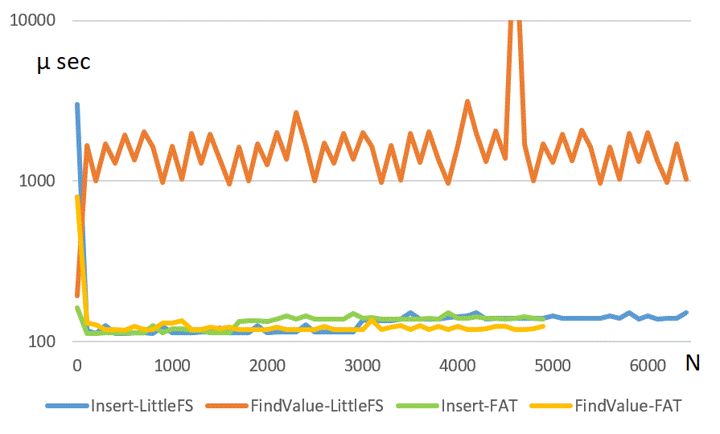

# C++ persistent key-value pairs for Arduino (ESP32 boards with flash disk)

Persistent key-value pairs library that offers a kind of structured data storage. It can be used as a small and simple database. Please consider that it is still in beta stage. Any feedback is welcome. 

## Basic operations (see BasicUsage.ino)

   - Insert (new key-value pair)
   - Find (value if a key is known)
   - Update (value for a given key)
   - Delete (key-value pair)
   - Truncate (delete all the key-value pairs)
   - Iterate (through all the key-value pairs)

## Some thoughts and numbers

### How many persistent key-value pairs can reside in the controller?

Well, it depends, but if we make some assumptions we can give some answers. Say persistentKeyValuePairs is running on ESP32 with a FAT partition scheme having 1.2 MB app memory and relatively small 16 bit integer keys. Then up to 5200 keys can fit into the controller's heap memory. Values, on the other hand, are only kept on the flash disk.

### How fast the insert and find operations are?

Time complexity of a balanced binary search tree implemented beneath persistent key-value pairs can be estimated by O (log n), where n is the number of key-value pairs already inserted. But the max number of key-value pairs is relatively small so the speed of disk IO operations prevails. LittleFS file system uses less memory and leaves more of it to the persistent key-value pairs. But regarding the speed of IO operations, FAT file system perform much better. Here are some measurements:

